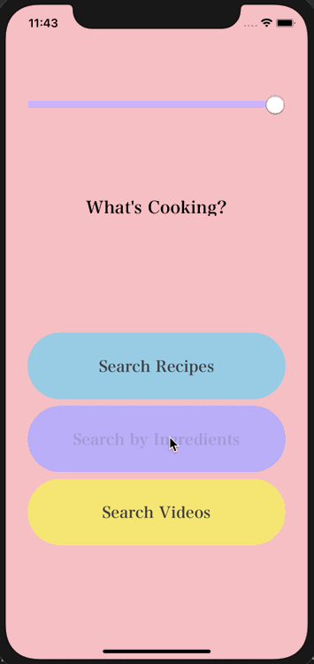
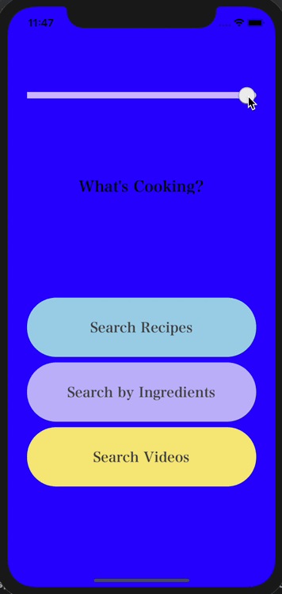

# Interaction Design
Coursework from CMSI 370: Interaction Design completed at LMU

## Assignment: iOS Application
What's Cooking is an iOS mobile application coded using Swift and using storyboard vision to effectively wire API output to user display. 
This project applies interaction design principles of usability to guide design and navigation functionaility decisions.
What's Cooking has 3 main features:
1. Allows user to type in desired recipe and get Spoonacular API query results.

2. Allows user to input ingredients with comma seperated values and get recipe results that maximize the number of used ingredients.

3. Allows user to search for relevant recipe videos and opens links in YouTube to watch. 

Coded in Swift using Xcode

## Assignment: Reusable Component
This assingment was to create a reusable direct manipulation User Interface component, that a user can interact with and see direct results. I decided to make a slider that when slid to the left, strobes slowly between blue and white. When slid to the right, the background strobes faster between blue and white. 

Coded in Swift using Xcode

